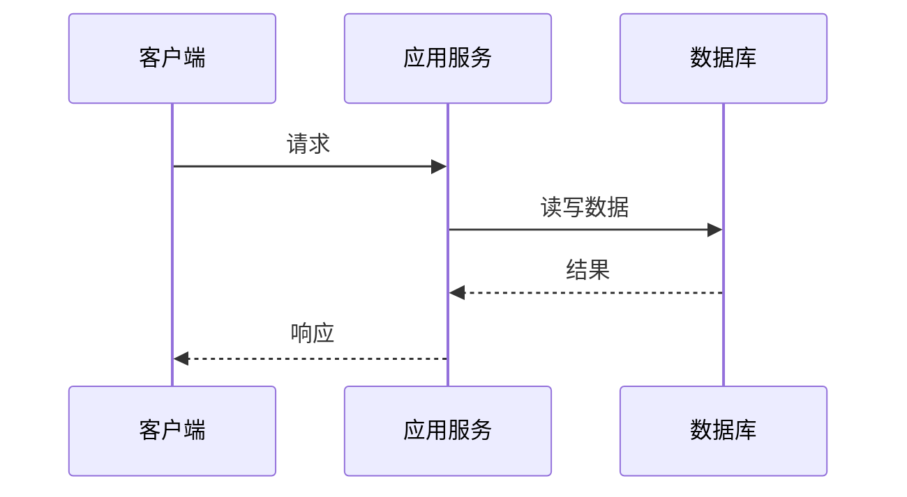

# 系统设计文档

> 文档状态：草稿 / 评审中 / 已批准 / 已废弃  
> 版本：v0.1  
> 作者：`姓名`  
> 最后更新：`YYYY-MM-DD`  
> 关联需求：`需求链接或编号`

## 1. 背景与目标

### 1.1 背景

<!-- `说明当前业务问题、现有系统限制及为什么需要此次建设。` -->
- 用例用飞书的思维导图承载，仅适合人阅读和飞书平台间的操作
- 用例只有一份存档，修改必定影响到所有人看到的内容

### 1.2 目标

<!-- - `目标 1：可衡量的业务或技术结果`
- `目标 2` -->
服务器:  
- 所有的用例有一个主线的版本，这个版本是仅可合并，只读的
- 每个产品迭代/版本都需要从主线版本切出来
- 用例在非主线版本是可编辑，可标记结果，可记录测试执行的
- 可以在非主线版本中选定用例创建测试任务，任务中的用例可标记结果，可记录测试执行，但是不可编辑
- 测试任务中的标记状态会同步到非主线版本中
- 非主线版本中任何状态(包括空文件夹)变化在合并之前都不会同步到主线版本
- 非主线版本之间没有联系通道，不会产生任何同步
- 非主线版本可以记录用例的编辑历史，多次的测试记录和每次对应的结果
- 非主线版本记录的用例历史在合并到主线的时候也会将历史记录合并进去并记录来源版本
- 非主线版本的用例在编辑/标记结果的时候会优先检查主线版本的最新状态，如果主线用例发生了变更，非主线版本要有提示
- 非主线版本可以拉取主线版本最新的用例状态(有用例文本冲突的地方不会覆盖，需要人工处理)
- 主线版本中存储的编辑记录是涉及用例文本的，可能会冲突。但是测试记录和结果是随版本的，版本间分开存储，不会冲突
- 用例ID具有唯一性，一个版本中不允许多处存在
- 非主线版本可以新建文件夹，可以新增用例，这些都不可以在主线版本操作

前端:  
- 页面中顶部的标题栏左边显示标题，右边提供按钮切换主题
- 除标题栏外的页面垂直分割，从左到右分别是用例树和详情界面，分割线部分可以用鼠标拖拽控制页面分割比例

- 用例树部分可以被鼠标拖拽到最左，这时候隐藏用例树(也就是折叠)，并提供一个 `>` 来再次展开用例树
- 最上面的是主线用例树，同级别的是其他从衍生版本的用例树
- 用例树的根节点是文件夹，文件夹可展开可折叠，展开无级别限制，可以展开到最底层显示目录中的用例列表
- 用例树中的用例可多选，左对齐(但不破坏树的层级结构)，勾选之后分区顶部提供批量操作按钮(导出，创建测试任务)
- 聚焦文件夹的时候，详情界面显示文件夹的详情(用例数量，子文件夹数量，创建者，时间等)
- 聚焦用例的时候展示用例的详情(用例的各个字段和一些控制按钮)
- 鼠标左键点击文件夹/用例时聚焦，右侧显示对应的详情
- 鼠标右键点击文件夹弹出菜单，提供新建文件夹，新增用例，导出用例，搜索，创建测试任务等功能，和主线同级的根节点右键额外提供"合并到主线"的功能
- 鼠标右键点击用例弹出菜单，提供测试记录的入口，编辑等功能(右侧详情要同步显示)
- 非主线的文件夹右键还提供重命名功能，但是只在文件夹为空的时候可用
- 主线目录的文件均只提供搜索功能，跟目录额外提供"创建测试版本"的功能(也就是创建同级的非主线目录)
- 搜索功能允许 *标题/id的模糊检索* 和 *针对用例字段做"包含"的精确检索*
- 搜索完成时在用例树这个界面分区的右边穿插新的一个分区"搜索结果"(这个分区可拖拽，可关闭，但不可折叠)
- "搜索结果"一种模式展示用例平铺列表，没有右键功能，左键点击聚焦然后右边详情界面展示用例详情
- "搜索结果"另一种模式展示文件夹结构，但是只展示有搜索结果的文件夹和最终的用例(除了内容多少，和用例树没什么区别)

- 用例详情视图中提供编辑按钮，点击后开启编辑模式，可修改用例文本
- 用例详情视图中提供"测试记录"按钮，右侧抽屉(可折叠，可关闭——关闭后会丢失未保存的测试记录)中可编辑测试记录，提供保存和提交按钮
- 已经提交的测试记录不允许更改
- 从主线打开的测试记录抽屉中可选择记录提交的版本，但非主线版本的测试记抽屉中不提供这个功能

- 测试任务的分区显示和用例树公用，在页面最左侧提供一个"测试任务/用例树"的切换按钮
- 测试任务按列表的形式展示，但鼠标左键点击任务后任务展开，内容按用例树的形式展示(同样只展示有内容的)

### 1.2.1 调试后追加的目标
- 用例左边的菱形图案不需要，保留复选框即可
- 网站顶部栏目新增一个入口，点击后跳转新页面，展示网站后端可用的API，API文档页左侧要加导航栏
- 测试记录内容的编辑窗口要是一个markdown编辑器，像泛用的markdown编辑器那样支持富文本
- 测试记录中的历史记录不要全部呈现，要折叠，只展示部分，点击的时候展示或者展开
- 编辑历史可点击跳转
- 主页面左侧用例树折叠的时候详情板块的的内容不变，如果原本就没有内容，提示要更友好一些

### 1.3 非目标

<!-- - `本次明确不处理的范围`
- `后续阶段再处理的事项` -->
- 暂不考虑用例删除功能，不需要的用例不用来创建任务即可
- 暂不支持用主线的部分用例创建非主线版本，只能全部clone

### 1.4 成功指标

| 指标 | 当前值 | 目标值 | 衡量方式 |
| --- | --- | --- | --- |
| `示例：接口 P95 延迟` | `—` | `< 200 ms` | `监控面板` |
| `指标名称` | `—` | `—` | `—` |

## 2. 范围与约束

### 2.1 功能范围

| 功能 | 描述 | 优先级 | 验收标准 |
| --- | --- | --- | --- |
| 创建测试版本 | 完全复制主线版本生成新的版本用于测试 | P0 | 创建版本后测试版本的内容与主线版本内容一样 |
| 创建测试任务 | 创建一个用于测试的任务(主要是缩小用例树，提供额外的视图) | P0 | 创建任务后，任务视图中出现新的任务 |
| 新建测试用例 | 往非主线版本中新增用例 | P0 | 可正常进入新增用例的编辑界面，编辑完成保存提交后目录中出现新的用例 |
| 编辑测试用例 | 变更用例的文本 | P0 | 编辑完保存提交后用例树和详情界面中的用例同步更新 |
| 新增测试记录 | 编写用例测试记录并存档 | P0 | 编写测试记录，标记测试结果(通过/阻塞/失败)后可以查询到对应的测试记录 |

* 其余的功能在 `目标` 中已经阐述，并非不重要，只是我列出的是最基础最重要的功能。

### 2.2 约束与假设

- **技术约束**：`语言、框架、部署环境、兼容性要求等`
  ```
  glang原生net/http
  前端只要实现目标，好看即可，但不能和后端耦合(二者在代码层面上有交互，但可以用后端的server开放前端的页面)
  可以在linux、windows中部署，也必须提供build目录和脚本提供一键编译打包和容器发布
  持久化由远端数据库负责
  后端实现一个轻量级的DB解耦层
  DB独立部署在另外一个容器中
  ```

- **业务约束**：`时间、预算、合规、数据地域等`
  ```
  本地使用，暂无要求
  ```

- **关键假设**：`尚待验证的前提`
  ```
  当前的用例结构短期内可能会变动
  ```

## 3. 总体设计

### 3.1 架构概览

<!-- `用 3～5 句话描述请求如何从用户进入系统、经过哪些核心组件、最终产生什么结果。` -->
- 后端不直接服务用户
- 请求从前端转发到后端
- 后端处理完用例后存储到DB中(可预留，但是暂无高并发场景)
- 由于DB和业务解耦，测试的时候提供一个mock用文件(或内存)做本地存储

### 3.2 组件职责

| 组件 | 职责 | 输入/输出 | 依赖 | 扩缩容策略 |
| --- | --- | --- | --- | --- |
| `组件名` | `主要职责` | `协议与核心数据` | `依赖项` | `策略` |

### 3.3 关键流程

#### `流程名称`

1. `触发条件与入口。`
2. `关键处理与校验。`
3. `数据写入、异步任务或外部调用。`
4. `返回结果与异常处理。`



## 4. 数据设计

### 4.1 数据模型

| 实体/表 | 用途 | 主键 | 重要字段 | 保留周期 |
| --- | --- | --- | --- | --- |
| `entity_name` | `说明` | `id` | `字段列表` | `周期` |

### 4.2 字段说明

| 字段 | 类型 | 是否必填 | 说明 | 示例 |
| --- | --- | --- | --- | --- |
| `id` | `UUID` | 是 | `唯一标识` | `…` |

### 4.3 一致性与数据生命周期

- **一致性模型**：`强一致 / 最终一致；说明原因。`
- **幂等设计**：`幂等键、去重机制或重复请求处理。`
- **迁移方案**：`建表、回填、双写、灰度、回滚。`
- **归档与删除**：`数据保留、脱敏、删除策略。`

## 5. 接口设计

### 5.1 API 清单

| 接口 | 方法 | 说明 | 调用方 | 鉴权 |
| --- | --- | --- | --- | --- |
| `/api/v1/resource` | `POST` | `创建资源` | `客户端` | `OAuth/JWT` |

### 5.2 接口详情：`接口名称`

```http
POST /api/v1/resource
Content-Type: application/json
```

**请求示例**

```json
{
  "name": "example",
  "requestId": "uuid"
}
```

**响应示例**

```json
{
  "id": "uuid",
  "status": "created"
}
```

| 状态码 | 场景 | 调用方处理 |
| --- | --- | --- |
| `200/201` | `成功` | `继续流程` |
| `400` | `参数错误` | `提示并修正` |
| `409` | `幂等冲突` | `查询已有结果` |
| `5xx` | `服务异常` | `按策略重试` |

## 6. 安全、隐私与合规

- **身份认证与授权**：`认证方式、角色/权限模型、租户隔离。`
- **敏感数据**：`字段分级、传输/存储加密、日志脱敏。`
- **审计**：`记录哪些操作、保留多久、谁可访问。`
- **合规要求**：`适用法规、数据驻留、删除请求处理。`
- **威胁与缓解**：`列出主要风险，如越权、注入、重放、泄露。`

## 7. 可靠性与性能

### 7.1 容量预估

| 项目 | 当前 | 峰值预估 | 增长假设 | 设计结论 |
| --- | --- | --- | --- | --- |
| `QPS` | `—` | `—` | `—` | `—` |
| `数据量` | `—` | `—` | `—` | `—` |

### 7.2 故障处理

| 场景 | 影响 | 检测方式 | 降级/恢复策略 | 负责人 |
| --- | --- | --- | --- | --- |
| `依赖超时` | `说明` | `告警` | `超时、重试、熔断、兜底` | `团队` |

### 7.3 SLO 与可观测性

- **可用性 SLO**：`例如 99.9%/月`
- **延迟 SLO**：`例如 P95 < 200 ms`
- **监控指标**：`流量、错误率、延迟、饱和度、业务指标。`
- **日志与链路追踪**：`关联 ID、关键事件、采样策略。`
- **告警策略**：`阈值、分级、值班与升级路径。`

## 8. 发布与运维

### 8.1 发布计划

1. `开发与自动化测试。`
2. `预发布验证及数据/权限检查。`
3. `灰度发布：范围、时长、观测指标。`
4. `全量发布与复盘。`

### 8.2 回滚方案

`说明代码、配置、数据迁移各自的回滚条件、步骤与负责人。`

### 8.3 运维手册链接

- `仪表盘：链接`
- `告警响应 Runbook：链接`
- `值班与升级：链接`

## 9. 测试策略

| 层级 | 覆盖内容 | 工具/方式 | 通过标准 |
| --- | --- | --- | --- |
| 单元测试 | `核心业务逻辑` | `测试框架` | `覆盖率/关键用例` |
| 集成测试 | `服务与依赖` | `测试环境` | `关键链路成功` |
| 压测 | `容量与瓶颈` | `压测工具` | `达到容量目标` |
| 安全测试 | `认证、授权、输入` | `扫描/人工` | `高危问题为零` |

## 10. 方案评估与决策

| 方案 | 优点 | 缺点 | 成本/风险 | 结论 |
| --- | --- | --- | --- | --- |
| `方案 A` | `—` | `—` | `—` | `采用/不采用` |
| `方案 B` | `—` | `—` | `—` | `采用/不采用` |

**最终决策**：`说明选择的方案及核心理由。`

## 11. 风险、待决问题与依赖

| 类型 | 项目 | 影响 | 应对措施/决策人 | 截止日期 | 状态 |
| --- | --- | --- | --- | --- | --- |
| 风险 | `风险描述` | `高/中/低` | `措施` | `日期` | `开放` |
| 待决问题 | `问题描述` | `高/中/低` | `负责人` | `日期` | `开放` |
| 外部依赖 | `依赖描述` | `高/中/低` | `负责人` | `日期` | `跟进中` |

## 12. 里程碑

| 阶段 | 交付物 | 负责人 | 计划日期 | 状态 |
| --- | --- | --- | --- | --- |
| `设计评审` | `评审结论` | `姓名` | `YYYY-MM-DD` | `未开始` |
| `上线` | `发布完成` | `姓名` | `YYYY-MM-DD` | `未开始` |

## 附录

### A. 术语表

| 术语 | 含义 |
| --- | --- |
| `术语` | `解释` |

### B. 变更记录

| 日期 | 版本 | 作者 | 变更说明 |
| --- | --- | --- | --- |
| `YYYY-MM-DD` | `v0.1` | `姓名` | `初始版本` |
